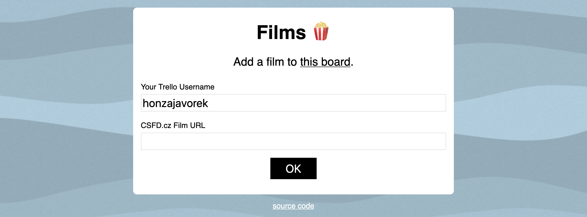

# film2trello

Simple app which allows me and my wife to use [Trello](http://trello.com/) as our "To Watch" list for films. Currently works with [CSFD.cz](http://csfd.cz) only.



## How does it work?

When you navigate to the main page of the app, it allows you to submit a CSFD.cz URL of a film. When submitted, it downloads basic information about the film and creates a card in the first column (assumed inbox) of your "To Watch" Trello board.

Your Trello username is remembered using cookies. The Trello board is hardcoded in the settings of a particular instance of the app.

### Bookmarklet

After submitting your first film, the page offers you a [bookmarklet](https://en.wikipedia.org/wiki/Bookmarklet). You can drag it into your browser's interface and make it a button. Every time you're on a [CSFD.cz](http://csfd.cz) page about a film, e.g. [csfd.cz/film/8365-vyvoleny/](http://www.csfd.cz/film/8365-vyvoleny/), and you want to save it to your "To Watch" Trello board as a card, just click on the button.


## Installation

### Preparation

Set the following environment variables:

- **`TRELLO_KEY`** - Get it at the [Trello app key page](https://trello.com/app-key).
- **`TRELLO_TOKEN`** - Get it at the [Trello app key page](https://trello.com/app-key). Make a GET request to `https://trello.com/1/authorize?expiration=never&scope=read,write&response_type=token&name=film2trello&key=<TRELLO_KEY>`, where `TRELLO_KEY` is the key above.
- **`TRELLO_BOARD`** - An ID of the Trello board you want to work with. Get it from its URL, e.g. if the URL of the board is `https://trello.com/b/mF7A3n3J/filmy-test`, then `mF7A3n3J` is the ID.
- **`FLASK_SECRET_KEY`** - Something random (see [docs](https://flask.palletsprojects.com/en/1.1.x/config/#SECRET_KEY)).

### Development

Create a virtual environment and install dependencies from the `requirements.txt` file. Run `pytest` to execute tests. To run the app locally:

```
$ FLASK_DEBUG=1 FLASK_APP=film2trello flask run --port=3000 --reload
```

To see how the app will behave when deployed, [install now](https://zeit.co/download) and run `now dev`. For that, you'll also need a local `.env` file with all the necessary environment variables (see [docs](https://err.sh/now/missing-env-file)).

### Deployment

You can deploy manually by [installing now](https://zeit.co/download) and running `now` or `now --prod` it in the directory of the project. To set the environment variables, use `now secrets`.


## Aerovod support

The app can create cards with information about whether the film is available at [Aerovod](https://aerovod.cz). For this to work correctly, an updated file `./film2trello/aerovod.json` needs to be present. It can be created using the following script:

```
$ python -m aerovod > ./film2trello/aerovod.json
```


## License

[MIT](LICENSE)
